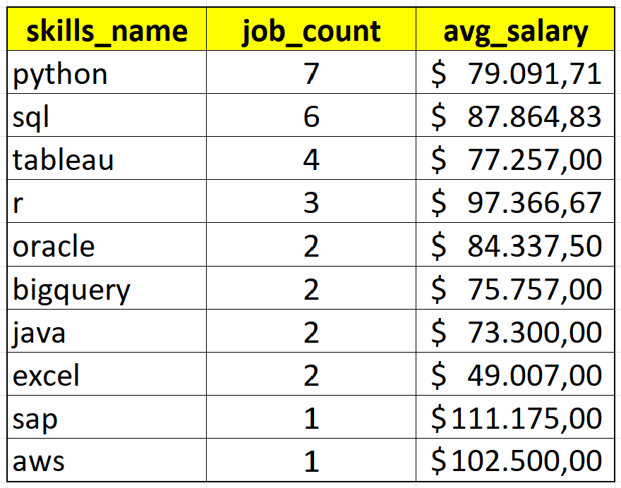

# Introduction

In this document, I will go over an analysis I did as part of Luke Barousse's SQL course. The project focusing on Data Analyst roles in Italy and explores 💰 top-paying jobs, 🔥 in-demand skills, and 📈 where high demand meets high salary in data analytics.

🔍 SQL queries? Check them out here:

# Background
Driven by the goal of improving my SQL skills, I decided to follow Luke Barousse's [YouTube course](https://www.youtube.com/watch?v=7mz73uXD9DA&list=PL_CkpxkuPiT-RJ7zBfHVWwgltEWIVwrwb). This course is well structured, easy to follow and full of practical exercises.
Special thanks to Luke and Kelly Adams for this amazing SQL course and thank you for sharing your valuable knowledge with the world.

The data used for this project comes from Luke Barousse's [datanerd.tech app](https://datanerd.tech/), which helps identify key insights for data-related jobs.

### The questions I wanted to answer through my SQL queries were:
1. What are the top-paying data analyst jobs in Italy?
2. What skills are required for these top-paying jobs?
3. What skills are most in demand for data analysts?
4. Which skills are associated with higher salaries?
5. What are the most optimal skills to learn?

# Tools Used
To create this project I used the following tools:

- **SQL:** used to query the database and unearth critical information.
- **PostgreSQL:** the database management system for handling the data.
- **Visual Studio Code:** for database management and executing SQL queries.
- **Git & GitHub:** essential for version control and sharing my SQL scripts and analysis.

# The Analysis
Each query for this project aimed at investigating specific aspects of the data analyst job market in Italy. Here’s how I approached each question:

### 1. Top Paying Data Analyst Jobs
To identify the highest-paying roles, I filtered data analyst positions by average yearly salary and country. This query highlights the high paying opportunities in the field.

```sql
SELECT
    job_id,
    job_title,
    job_schedule_type,
    salary_year_avg,
    job_posted_date,
    company_dim.name AS comany_name
FROM 
    job_postings_fact
LEFT JOIN company_dim
ON job_postings_fact.company_id = company_dim.company_id
WHERE
    job_title_short = 'Data Analyst'
    AND job_country = 'Italy'
    AND salary_year_avg IS NOT NULL
ORDER BY
    salary_year_avg DESC
LIMIT 10;
```
Here's the breakdown of the top data analyst jobs in 2023:
- **Wide Salary Range:** Top 10 paying data analyst roles span from $111175.00 to $51014.00, indicating significant salary potential in the field.
- **Job Title Variety:** There's a high diversity in job titles reflecting varied roles and specializations within data analytics.


*Bar graph to show the top 10 paying job roles*

### 2. Skills for Top Paying Jobs
To understand what skills are required for the top-paying jobs, I joined the job postings tables with the skills data tables, using the following query:
```sql
WITH top_paying_jobs AS (
    SELECT	
        job_id,
        job_title,
        salary_year_avg,
        name AS company_name
    FROM
        job_postings_fact
    LEFT JOIN company_dim ON job_postings_fact.company_id = company_dim.company_id
    WHERE
        job_title_short = 'Data Analyst' 
        AND job_country = 'Italy' 
        AND salary_year_avg IS NOT NULL
    ORDER BY
        salary_year_avg DESC
)

SELECT 
    top_paying_jobs.*,
    skills
FROM top_paying_jobs
INNER JOIN skills_job_dim ON top_paying_jobs.job_id = skills_job_dim.job_id
INNER JOIN skills_dim ON skills_job_dim.skill_id = skills_dim.skill_id
ORDER BY
    salary_year_avg DESC;
```
Here's the breakdown of the most demanded skills for the top 10 highest paying data analyst jobs in 2023 in Italy:
- **Python** is the most frequently mentioned skill, appearing in 7 job postings.
- **SQL** follows closely, required in 6 job postings.
- **Tableau** is also required, appearing in 4 job postings.


*Bar graph visualizing the count of skills for the top 10 paying jobs for data analysts*


### 3. In-Demand Skills for Data Analysts

This query helped identify the skills most frequently requested in job postings, directing focus to areas with high demand.

```sql
SELECT
    skills AS skills_name,
    COUNT(skills_job_dim.skill_id) AS demand_count
FROM
    skills_job_dim
INNER JOIN skills_dim ON skills_job_dim.skill_id = skills_dim.skill_id
INNER JOIN job_postings_fact ON skills_job_dim.job_id = job_postings_fact.job_id
WHERE
    job_title_short = 'Data Analyst'
    AND job_country = 'Italy'
GROUP BY
    skills
ORDER BY
 demand_count DESC
LIMIT 5;
```
Here's the breakdown of the most demanded skills for data analysts in 2023 in Italy:
- **Excel** and **SQL** remain fundamental, emphasizing the need for strong foundational skills in data processing and spreadsheet manipulation.
- **Programming** and **Visualization Tools** like **Python**, **Power BI**, and **Tableau** are essential, pointing towards the increasing importance of technical skills in data storytelling and decision support.

| Skills       | Demand Count |
|--------------|-------------:|
| Excel        |     1730     |
| SQL          |     1346     |
| Python       |     1000     |
| Power BI     |      657     |
| Tableau      |      578     |

*Table of the demand for the top 5 skills in data analyst job postings*

### 4. Skills Based on Salary
Exploring the average salaries associated with different skills revealed which skills are the highest paying in 2023 in Italy.
```sql
SELECT
    skills AS skills_name,
    ROUND(AVG(salary_year_avg),2) AS avg_salary
FROM
    job_postings_fact
INNER JOIN skills_job_dim ON job_postings_fact.job_id = skills_job_dim.job_id
INNER JOIN skills_dim ON skills_job_dim.skill_id = skills_dim.skill_id
WHERE
    job_title_short = 'Data Analyst'
    AND job_country = 'Italy'
    AND salary_year_avg IS NOT NULL
GROUP BY
    skills_name
ORDER BY
    avg_salary DESC
LIMIT 10;
```

| Skills        | Average Salary ($) |
|---------------|-------------------:|
| SAP           |     111175.00      |
| Looker        |     102500.00      |
| Azure         |     102500.00      |
| AWS           |     102500.00      |
| Crystal       |     100500.00      |
| Qlik          |     100500.00      |
| R             |      97366.67      |
| Flow          |      89100.00      |
| SQL           |      87864.83      |
| Oracle        |      84337.50      |


*Table of the average salary for the top 10 paying skills for data analysts*

### 5. Most Optimal Skills to Learn

Combining insights from demand and salary data, this query aimed to pinpoint skills that are both in high demand and have high salaries, offering a strategic focus for skill development.

```sql
SELECT
    skills AS skills_name,
    COUNT(skills_job_dim.skill_id) AS job_count,
    ROUND(AVG(salary_year_avg),2) AS avg_salary
FROM
    job_postings_fact
INNER JOIN skills_job_dim ON job_postings_fact.job_id = skills_job_dim.job_id
INNER JOIN skills_dim ON skills_job_dim.skill_id = skills_dim.skill_id
WHERE
    job_title_short = 'Data Analyst'
    AND job_country = 'Italy'
    AND salary_year_avg IS NOT NULL
GROUP BY
    skills_name
ORDER BY
    job_count DESC,
    avg_salary DESC
Limit 10;
```



*Table of the most optimal skills*

### **What I Learned**

Here is a summary of the skills I improved during this project:

1. **Using Advanced SQL Features** like Common Table Expressions (CTEs) and multi-table JOINs, which helped me perform more sophisticated analysis

2. **Getting Good with Grouping and Aggregation**: Learning to aggregate and cluster data has been key to digging deeper into trends, such as understanding which skills are in high demand or which jobs pay the most.

3. **Crafting Insights from Data**: Turning query results into meaningful insights was like solving a series of puzzles. This project has really enhanced my ability to see beyond the numbers and understand what they are telling me.

## Summary💡

Through this project I was able to identify the following key information relating to the Data Analyst job in Italy in 2023:

1. The **Top Paying Jobs** was the 'SAP Data Analyst' with an average salary of $ 111175.00.

2. The **Skills For Top Paying Jobs** were Python, SQL and Tableau.

3. The **Most Demanded Skills** were Excel, SQL, Python, Power BI and Tableau.

4. The **Skills Associated with Higher Salaries** were SAP, Looker, Azure and AWS.

5. The **Most Optimal Skills** were Python, SQL and Tableau.